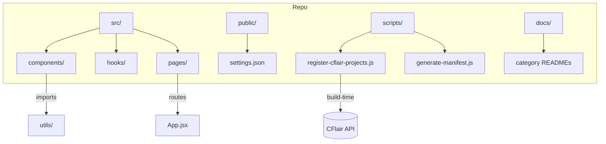

````markdown
# Repository architecture

This page provides a high-level diagram and descriptions of the main parts of the repository: `src/`, `public/`, `scripts/`, `docs/`, and CI/workflow wiring.



Quick descriptions

- `src/` — React app sources (components, pages, hooks, utils)
- `public/` — static assets and `settings.json` used for runtime configuration
- `scripts/` — helpers and build-time scripts (see `docs/devops/scripts.md`)
- `docs/` — this documentation tree (category READMEs and per-file docs)
- `.github/workflows/` — CI/deploy pipelines that run `npm run build` and other scripts

This diagram and the linked documents are intended to be a one-stop overview for new contributors and for the GitHub Wiki conversion.

````
