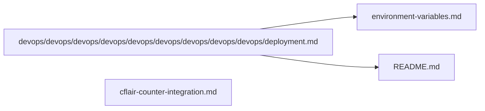

# 🚀 Build & Deployment

Mermaid diagram (overview):

Files in this category:

- `devops/devops/devops/devops/devops/devops/devops/devops/devops/deployment.md` — deployment recipes for Vercel, Cloudflare Workers, and static hosting.

  Table of contents:
  -

- `environment-variables.md` — list of env vars used by build and runtime.

  Table of contents:
  -

- `cflair-counter-integration.md` — third-party integration details.

  Table of contents:
  -

  Table of contents:
  -

