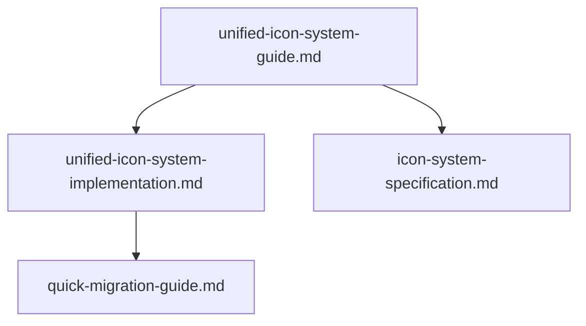

# 📦 Icon System

Mermaid diagram (overview):

Files in this category (do not move files, just reference):

- `unified-icon-system-guide.md` — conceptual guide: goals, design principles, usage recommendations.

  Table of contents:
  -

- `unified-icon-system-implementation.md` — implementation notes, code paths, and integration tips.

  Table of contents:
  -

- `icon-system-specification.md` — formal specification (config schema, governance).

  Table of contents:
  -

- `quick-migration-guide.md` — migration steps and automated scripts.

  Table of contents:
  -

