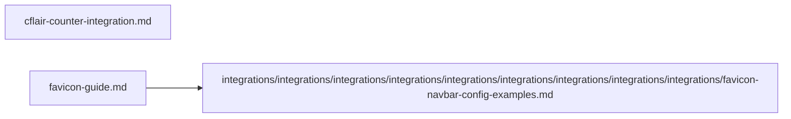

# 🔌 Integrations

Mermaid diagram (overview):

Files in this category:

- `cflair-counter-integration.md` — details about service integration and endpoints.
  Table of contents:
  -

- `favicon-guide.md` — dynamic favicon generation and best practices.

  Table of contents:
  -

- `integrations/integrations/integrations/integrations/integrations/integrations/integrations/integrations/integrations/favicon-navbar-config-examples.md` — concrete examples for navbar favicon usage.

  Table of contents:
  -

