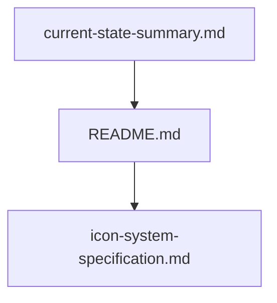

# 🗞️ Miscellaneous

Mermaid diagram (overview):

Files in this category:

- `current-state-summary.md` — snapshot of current project state.

  Table of contents:
  -

- `icon-system-specification.md` — top-level icon system spec (also listed in Icon System category).

  Table of contents:
  -

- `README.md` — root project README (referenced from docs).

  Table of contents:
  -

