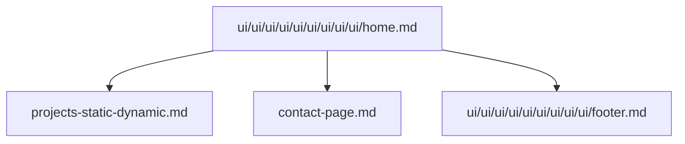

# 🧩 Pages & Components

Mermaid diagram (overview):

Files in this category:

- `ui/ui/ui/ui/ui/ui/ui/ui/ui/home.md` — home page components and data flows.

  Table of contents:
  -

- `projects-static-dynamic.md` — static vs dynamic projects rendering and data sources.

  Table of contents:
  -

- `contact-page.md` — contact form configs and endpoints.

  Table of contents:
  -

