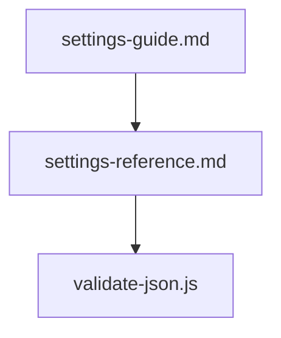

# ⚙️ Settings

Mermaid diagram (overview):

Files in this category:

- `settings-guide.md` — tutorial on how to configure `settings.json` and sample patterns.

  Table of contents:
  -

- `settings-reference.md` — exhaustive field-by-field reference and schema notes.

  Table of contents:
  -

- `validate-json.js` (referenced) — CI validation script for `settings.json`.

  Table of contents:
  -

