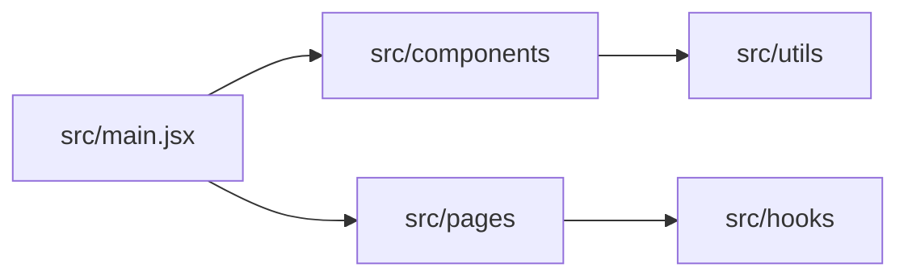

````markdown
# src/ — Application source overview

This section documents the application's source code layout (`src/`) and provides quick references to major folders: `components/`, `utils/`, `hooks/`, and `pages/`.

Use the per-folder overview pages for quick file descriptions and important notes.

- Components: `docs/src/components.md`
- Utils: `docs/src/utils.md`
- Hooks: `docs/src/hooks.md`
- Pages: `docs/src/pages.md`

Mermaid overview:



If you'd like fully-generated per-file docs (one file per source file) I can produce them in a follow-up pass.

````
