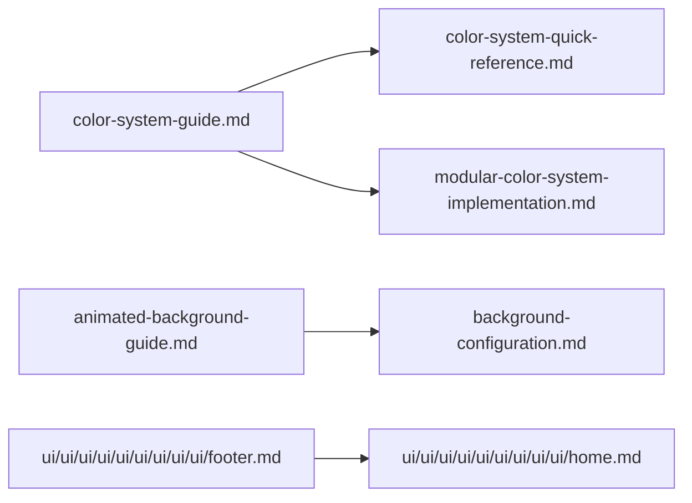

# 🎨 UI & Theme

Mermaid diagram (overview):

Files in this category:

- `color-system-guide.md` — high-level color system design and tokens.

  Table of contents:
  -

- `color-system-quick-reference.md` — quick token lookup and usage examples.

  Table of contents:
  -

- `modular-color-system-implementation.md` — implementation specifics for Tailwind and token maps.

  Table of contents:
  -

- `animated-background-guide.md` — design rationale and runtime considerations.

  Table of contents:
  -

- `background-configuration.md` — schema and example JSON for background configs.

  Table of contents:
  -

- `ui/ui/ui/ui/ui/ui/ui/ui/ui/footer.md` — footer slots and customization options.

  Table of contents:
  -

- `ui/ui/ui/ui/ui/ui/ui/ui/ui/home.md` — home-page component reference and examples.

  Table of contents:
  -

